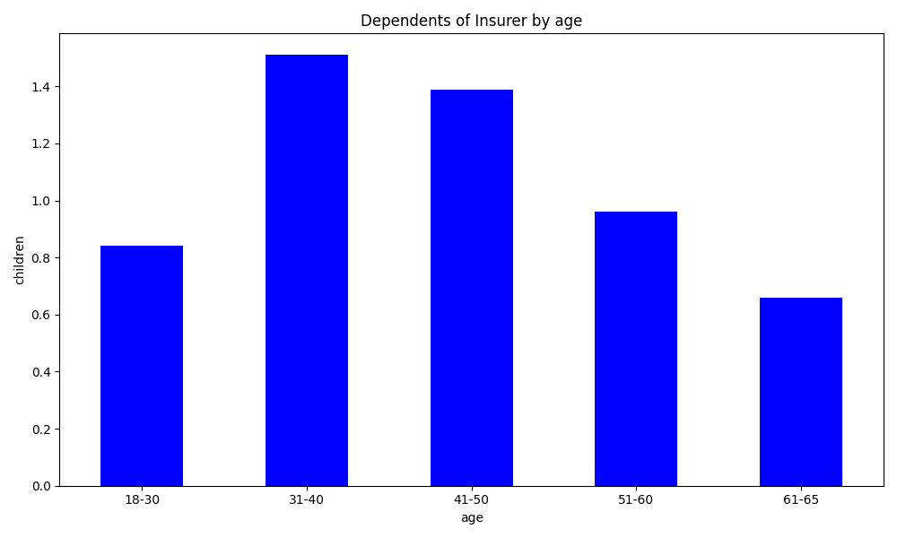

# 🩺 Insurance EDA & Visualization

This project performs Exploratory Data Analysis (EDA) on an insurance dataset. It includes insights on charges, age groups, smoking habits, BMI, dependents, and gender-based statistics. The goal is to extract meaningful patterns that may influence insurance charges and health-related risk factors.

---

## 📊 Features

- Descriptive statistics and data inspection
- Grouped summaries by:
  - Region
  - Age groups
  - Smoking status
  - Gender
- 🌲 Machine Learning:
  - Uses DecisionTreeRegressor to predict insurance charges
  - Tests various max_leaf_nodes to evaluate model accuracy (Mean Absolute Error)
  - Automatically finds the best tree size based on MAE
- Visualizations:
  - Bar chart of dependents by age group
  - Scatter plot of insurance charges vs smoker/BMI ratio
- Calculates a custom feature: `rate_of_smoker_by_bmi`
- Saves visualizations as `.png` files

---

📌 Key Functions

| Function Name                  | Description                                           |
| ------------------------------ | ----------------------------------------------------- |
| `read_data()`                  | Reads the CSV file into a DataFrame                   |
| `explore_data()`               | Performs exploratory analysis & feature engineering   |
| `ml_model()`                   | Trains multiple Decision Trees and finds the best one |
| `plot_dependents_of_insurer()` | Visualizes number of children by age group            |
| `plot_smoker_bmi_charges()`    | Plots insurance charges vs smoker/BMI ratio           |

---

## 📁 Files

| File                          | Description                              |
|-------------------------------|------------------------------------------|
| `insurance.csv`               | Source dataset                           |
| `eda_insurance.py`            | Main Python script with EDA logic        |
| `Insurance_charges_vs_Smoker_BMI_rate.png` | Scatter plot visualization |
| `Dependents_of_Insurer_by_age.png`        | Bar chart visualization     |

---

## 🛠️ How to Run

1. Ensure you have the required libraries:
   ```bash
   pip install pandas seaborn matplotlib
   
2. Run the script
   ```bash
   python eda_insurance.py

3. Output charts will be saved in the project directory.


📚 Dataset Info

Columns in the dataset:

    age: Age of primary beneficiary

    sex: Gender

    bmi: Body mass index

    children: Number of dependents

    smoker: Smoking status

    region: Residential area in the US

    charges: Individual medical costs billed by health insurance

## Key Insights / Findings

- *Smokers tend to be charged significantly more for insurance*, especially in higher BMI ranges.
- *Children vs Age*: People aged between X–Y tend to have more dependents.
- *Gender distribution is fairly even*, with minimal variance in average charges.


## Visualizations


